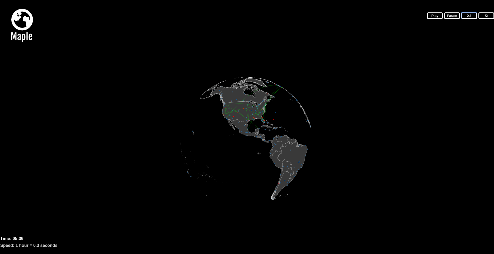

# Maple

[Live](http://takink.com/flight-visualization)

Maple is a flight traffic visualization application created using D3.js. It consists of a globe with major aiports plotted on top and flight animations on top.

# Overview

Maple is created using D3.js. D3 allows you to attach data to the DOM to create data based visualizations. I used D3 to create an orhographic rendering of the earth. I utilize D3 geoPath projections and geoOrthographic projections as well to create each individual country, airport and flight path.

D3 works visualization works by creating SVG elements.In order to interact with all of them together without side effects I grouped them in a <g> element.  

I utilized D3's zoom functionality to allow users to scale the globe.

For rotation I used the drag function. I am able to get the coordinates of the mouse click. In order to allow for efficient rotation, I utilized unit quaternions. Unit quaternions are encoded with the angle of rotation. D3's rotate function accepts Cartesian coordinates. Using D3's mouse function I took the Cartesian coordinates of starting and ending positions, performed cross multiplication to get the a perpendicular vector, dot product to get the magnitude, and converted it into quaternions in order to multiply it with the last rotation. D3's rotate function does not allow for dynamic rotation, rather it rotates from it's original position. Therefore I have to multiply the last rotation with the current rotation to find the overall Cartesian coordinates to input. 

## Download and parse data

The country and airport data comes from Natural Earth. They came in the form of shape files, which were translated into GeoJSON files and then stripped down to TopoJSON files. These were then parsed using the topojson.feature and turned into SVGs using data provided by D3.
